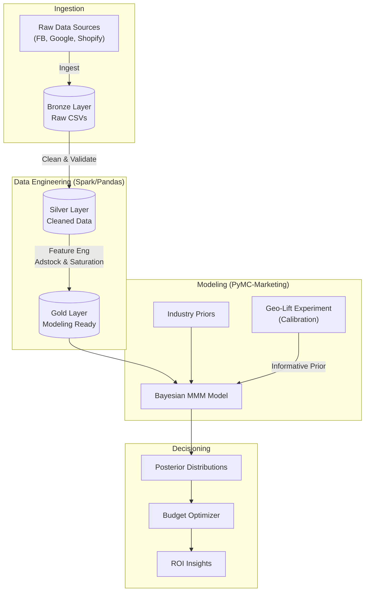

# Unified Measurement Framework: Bayesian Marketing Mix Modeling (MMM)

> **Objective:** To establish a production-grade analytics pipeline that quantifying marketing impact using Bayesian inference and Causal Calibration.

## About the Author
**Samkit Shah** | *Master of Data Science Graduate (Monash University) & Marketing Technology Professional*

> *"Bridging the gap between Media Strategy and Bayesian Statistics."*

With 3 years of experience at **Publicis Global Delivery** managing large-scale campaigns and a rigid academic foundation in Data Science, I built this project to solve the industry's biggest challenge: **Measurement in a Privacy-First World**.

---

## The Problem: The "Attribution Crisis"
Digital marketing measurement is broken.
-   **Privacy Changes:** iOS 14+ and cookie deprecation have rendered deterministic tracking (MTA) unreliable.
-   **Walled Gardens:** Facebook and Google grade their own homework, often over-claiming credit.
-   **The Blind Spot:** Traditional models ignore the "invisible" impact of brand building (TV, Viral TikToks) that doesn't result in an immediate click.

**The Solution?** Moving away from user-level tracking to **Top-Down Statistical Modeling**.

---

## System Architecture: The "Unified" Approach
We don't just run a regression; we build a **Production-Grade Pipeline** mirroring a modern Lakehouse architecture.



---

## Bayesian Technical Appendix: Why PyMC?
Why use Bayesian Inference instead of standard Machine Learning (Regression/Gradient Boosting)?

1.  **Prior Knowledge**: We can mathematically encode industry expertise (e.g., *"TV effects last longer than Social effects"*) using **Priors**.
2.  **Uncertainty Quantification**: Instead of a single "ROAS" number, we get a **Posterior Distribution**, telling us the *probability* of an outcome (e.g., *"There is a 95% chance TikTok ROI is between 2.5 and 3.1"*).
3.  **Small Data Resilience**: MMM datasets are small (3 years = ~150 weekly points). Deep Learning overfits; Bayesian methods robustly handle uncertainty.

**Core Tech Stack:** `PyMC`, `PyMC-Marketing`, `ArviZ`, `Pandas`, `Matplotlib`.

---

## Executive Summary
This project answers the critical question: *"Where should the next $1M be spent?"*

**Key Capabilities:**
1.  **Ingestion**: Robust pipelines for cross-channel data.
2.  **Calibration**: Integrating "Ground Truth" from Geo-Lift experiments to unbias the model.
3.  **Optimization**: Budget allocation algorithms to maximize Revenue/ROI under constraints.

---

## Getting Started

### Prerequisites
- Python 3.10+
- Recommended: High-performance environment for MCMC sampling.

### Installation
```bash
pip install .
```

### Usage
Follow the pipeline to replicate the analysis:

1.  **Generate Data**:
    ```bash
    python src/data_engineering/generate_synthetic_data.py
    ```
    *Creates `data/bronze/beauty_brand_mmm.csv`*

2.  **Process Data (Medallion Architecture)**:
    ```bash
    python src/data_engineering/process_silver.py
    python src/data_engineering/process_gold.py
    ```
    *Enginners features (Adstock/Saturation) -> `data/gold/`*

3.  **Train Bayesian Model (ADVI)**:
    ```bash
    python src/modeling/train_model.py
    ```
    *Trains the initial probabilistic model using Variational Inference.*

4.  **Run Geo-Experiment (Calibration)**:
    ```bash
    python src/modeling/simulate_geo_experiment.py
    python src/modeling/calibrate_model.py
    ```
    *Simulates a Melbourne lift test and retrains the model with the new "Ground Truth" prior.*

5.  **Optimize Budget**:
    ```bash
    python src/modeling/budget_optimizer.py
    ```
    *Outputs the optimal media mix recommendations.*

## Key Results
**Optimization Opportunity:** Found **$83,713 (+4.8%)** in daily revenue lift by reallocating budget.

| Channel | Action | Rationale (Data-Driven) |
| :--- | :--- | :--- |
| **TikTok** | **Cut 50%** | Geo-Experiment revealed ROAS (3.5) was lower than Modeled (5.2). |
| **Google** | **Boost 50%** | capturing high-intent demand; S-Curve analysis shows room to scale. |
| **FB** | **Boost 39%** | Strong visual driver with efficient CPA. |

## Project Structure
- `data/`: Medallion architecture storage.
- `src/`: Source code.
    - `data_engineering`: ETL and Feature Engineering.
    - `modeling`: PyMC models, Simulation, and Optimization logic.
- `reports/`: Executive summaries and debugging logs.
- `notebooks/`: Exploratory analysis.